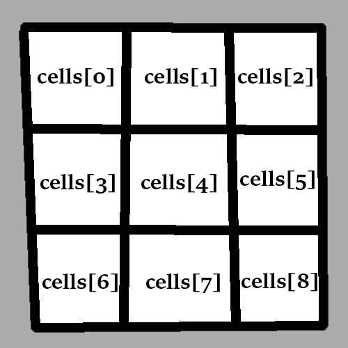

# Tic-Tac-Toe

## Learning Competencies
- Further your understanding of how and when to use:
    - Variables
    - Arrays
    - Functions
    - Loops
    - Conditional Statements
    - Event Listeners
- Create multiple small functions
- Debug code you have written
- Practise working with more complex algorithms
- Know when to ask for help, and don't stay stuck for too long.

## Break it down

<details>
<summary><b>Expand break-down details</b></summary>
Open the `index.html` in your browser to see the user interface. Let's use it as a visual aid to figure out what we need to build in our JavaScript file. We have:

- a title, "Tic-Tac-Toe"

- a 3x3 grid, and each cell should:
    - be clickable
    - display an "X" or an "O" once a player has clicked that grid cell for their turn

- a subtitle ("Click on a cell to start!"), which when a player:
    - clicks a grid cell to mark it, should change to inform the other player it's now their turn
    - has won, should tell us who won the game.

So let's think about how we can do this and then tackle the parts one by one. We need:

1) an array containing all the squares of the board
2) the ability to click each square and put either an X or an O into it
3) a boolean to keep track of whose turn it is, X or O, and logic to switch turns once a player makes a move  
4) logic to display whose turn it is
5) a function that checks if the game has been won
6) logic to display "_ WON!" when a player wins.
    
</details>
 
## An array of TD's (AKA the board & cells)

<details>
<summary><b>Expand cell array details</b></summary>
An [HTML Table](https://www.w3schools.com/html/html_tables.asp) is a fairly common way of displaying spreadsheet style data on the web. It has `TR` children elements, which is short for 'Table Row'. Those `TR` elements in turn have `TD` children elements. TD is short for 'Table Data' and it's the part we're really interested in here. Our board for Tic-Tac-Toe is nine `TD` elements in total. As with all HTML elements, we can access and edit their properties using JavaScript.
 
For example, if I had a variable (let's call it `myCell`) representing a particular cell (`TD`) in an HTML table, I could edit what is inside the cell by accessing it's `.innerHTML` property like this:
 
`myCell.innerHTML = "X"` or `myCell.innerHTML = "O"`
 
Which is the equivalent of `<td>X</td>` or `<td>O</td>` if we were writing it straight into the HTML file.
`.innerHTML` literally means "what is inside the HTML tag".
 
So with that info, we know how to put X's or O's into any particular cell, but how do we know _which_ cell to put them into, and _when_ it should happen? This is where the _array of cells_ we mentioned earlier (in our overview) comes in. If we had an array of all the `TD` elements, we could "bind a function to their onclick method" - which is a complicated way of saying: "when I click on something, something happens".
 
So how do we get the array of all the cells? Luckily, this is a pretty common desire in programming. You've probably seen `document.getElementById()` before, which we can use to get back a single HTML element using its `ID`. There is another handy method called [document.getElementsByTagName()](https://www.w3schools.com/jsref/met_document_getelementsbytagname.asp) which gives us back _an array of every element of a certain type_. For example, give me all the `<p>` tags, or all the `<h1>` tags.
 
Using this method, we can create a new array of all the `<td>` tags like so:

`let cells = document.getElementsByTagName("TD")`
 
And just like that, we've got the nine cells that make up our board! Go ahead and add that snippet to your `game.js` file. 
</details>
    
## Binding the onclick method (AKA 'when I click on something, something happens')
 
<details>
<summary><b>Expand onclick binding details</b></summary>
Every HTML element has a built-in `.onclick` method. At first they do nothing, but you can tell them to do anything you want. For example, put the following code into your `game.js` file:
 
```game.js
 
function sayHello () {
    console.log("hello")
}
 
cells[0].onclick = sayHello
```
 
Refresh the `index.html` file in your browser and click on the top left square of the board.
If you open your browser developer tools, in the Console tab you should see the "hello" message printing.
 
Woohoo! Now, if you really wanted to, you could put this into your `game.js` file:
 
```game.js
cells[0].onclick = sayHello
cells[1].onclick = sayHello
cells[2].onclick = sayHello
cells[3].onclick = sayHello
cells[4].onclick = sayHello
cells[5].onclick = sayHello
cells[6].onclick = sayHello
cells[7].onclick = sayHello
cells[8].onclick = sayHello
```
 
This does the trick, but is not very efficient. [Don't repeat yourself](https://en.wikipedia.org/wiki/Don%27t_repeat_yourself).

Whenever you find yourself doing something over and over again, what you almost always want is a Loop. The computer can then loop over the repetitive task, saving the programmer (you), from needing to do it.

Something we know about loops is that they have an "Iterator" (`let i = 0`) which represents how many times we have been through the loop. The iterator increases each time we finish a cycle of the loop (`i++`) until it surpasses some kind of limit (`i < cells.length`) and then the loop stops.
 
So because we know the iterator starts at 0, and then becomes 1, 2, 3, 4, 5, etc. We can use it to bind the onclick method to all of our cells in a single line of looped code:
 
```game.js
for (let i = 0; i < cells.length; i++) {
    cells[i].onclick = sayHello
}
```
 
That's much better! But we want to do more than say hello, so let's continue.
</details>
    
## Set up the defaults

<details>
<summary><b>Expand defaults details</b></summary>

This step is fairly straightforward, we're going to set up some defaults for the beginning of the game.

``` 
let noughtsTurn = true

let gameIsOver
```

The default starting player will be noughts, and the game should only be over when it has met the winning conditions. We'll refer to these in later code, but they need to be declared at this point.  

</details>
 
## The cellClicked(e) function PART I

<details>
<summary><b>Expand cellClicked details (Part I)</b></summary>
        
Now we're going to write the _real_ function that will execute when you click on a cell, rather than saying hello. In programming there is a concept called a ["stub"](https://en.wikipedia.org/wiki/Method_stub). As with so many things in the coding world, "stub" can mean a few different (but similar) things. In this context, "stub" refers to a function that will _eventually_ do what you want it to do, but in the meantime it acts as a placeholder of sorts. It might look like:
 
```game.js
function cellClicked(e) {
 
    let cell = e.target
    console.log("i clicked on: " + cell)
 
}
```
 
Then, back inside your loop from earlier, you could replace `onclick = sayHello` with `onclick = cellClicked`. This is another reason why [DRY code](https://en.wikipedia.org/wiki/Don%27t_repeat_yourself) is best. Instead of having to remember and find all the nine times you bound the onclick method, changing that single line in the loop changes it for every cell on the board.
 
Now you might be wondering, what is going on with that `(e)` argument, and what is `e.target`? The `e` stands for event. It is a secret argument that JavaScript _automatically_ slips into every function executed by an `.onclick` method. It's a little bit sneaky because it happens magically behind the scenes. You can read more about [DOM events here](https://www.w3schools.com/jsref/dom_obj_event.asp) but the [TL;DR](https://www.merriam-webster.com/dictionary/TL%3BDR#:~:text=1%20%3A%20too%20long%3B%20didn',even%20sit%20down%20and%20read) is they are **huge** objects containing heaps of information about everything that happened the moment you clicked on that HTML element including, most importantly for us, _which_ HTML element you clicked on. This is important for what we're trying to do because we need to know _which_ cell to put an X or an O inside.
 
The specific HTML element you clicked on is called the `target` of the click event, so by saying `let cell = e.target`, we can create a new variable representing the cell we clicked on. Add the above `cellClicked(e)` code to your `game.js`, then refresh your browser and look in the developer tools Console, you should be able to click on cells and see that `"i clicked on: " + cell` message popping up.

*Note, as with _all_ argument and variable names, there is nothing "magic" about the letter `e`. You could write `cellClicked(bananas)` and create the `let annie = bananas.target` variable and it would work in exactly the same way. The names we give to arugments and variables are for _us_, the programmers. The computer only cares about what _data_ is assigned to the arguments and variables that _we_ name.   
 
</details>
    
## The cellClicked(e) function PART II
 
<details>
<summary><b>Expand cellClicked details (Part II)</b></summary>
    
Now we're going to practise another crucial skill when it comes to writing more complicated algorithms: [PSEUDOCODE](https://www.geeksforgeeks.org/how-to-write-a-pseudo-code/). Often it takes new programmers a long time to embrace pseudocode. They can dive right into writing the function with a very blurry understanding of what they want to happen. It's like driving in roughly the right direction with a vague idea of where you want to end up. You'll probably get there eventually, but it will take a _lot_ longer, and realising that you have been driving down the wrong street for 20 minutes is extremely frustrating. So. . . don't do that! Make a plan, even just a few bullet points, before you start driving.
 
Here is some pseudocode for the `cellClicked(e)` function:
 
```game.js
// function for handling clicks on cells
function cellClicked(e) {
 
  // create a variable for the clicked cell so I can do stuff with it
 
  // if the cell is empty (check it's .innerHTML property)
 
      // figure out which symbol to put inside the cell ("O" or "X" based on the naughtsTurn boolean)
 
      // put the symbol inside the cell (by using .innerHTML again)
 
      // check to see if the player won with that move (probably using a new function, like checkForWin() which I'll need to write later)
 
          // if the game isn't over 
        
              // switch to the other player (using the naughtsTurn boolean again)
 
              // update the subtitle saying whose turn it is now
}
```
 
Writing that pseudocode doesn't take long. It might take you a little longer when you're new to programming, but don't sweat it. Taking time to plan your journey before you start writing code saves you an _immense_ amount of time and frustration in the long run. **So remember to do it!**
</details>

## Turning the pseudocode into CODE
<details>
<summary><b>Expand pseudocode-to-code details</b></summary> 
We're going to let you tackle writing the real contents of `cellClicked(e)` yourself, but here are a few tips based on the pseudocode:
 
- _create a variable for the clicked cell so I can do stuff with it_

    We covered this one already with the `e.target`!
 
- _if the cell is empty (check it's .innerHTML property)_

    You can check to see if an HTML element is empty like `myVariableName.innerHTML == ""`
 
- _figure out which symbol to put inside the cell ("O" or "X" based on the naughtsTurn Boolean)_

    Creating a variable for the symbol is useful here (maybe `symbol`), and it could be a great time to practise using the [Ternary Operator](https://developer.mozilla.org/en-US/docs/Web/JavaScript/Reference/Operators/Conditional_Operator) if you're feeling adventurous, but an `if else` statement will work just as well.  
 
- _put the symbol inside the cell (by using .innerHTML again)_

    Once you've figured out which symbol to put inside the cell, put it in there using .innerHTML.
 
- _check to see if the player won with that move (probably using a new function, like checkForWin() which I'll need to write later)_

    You could create a stub `checkForWin()` function with nothing inside it for the time being, making the real function is the next step after writing this `cellClicked(e)` function. Hint: you will need to pass the `symbol` variable in when you call the `checkForWin()` function.    
  
- _if the game isn't over_

    You could use the logical NOT operator here to toggle the gameIsOver variable (e.g. !gameIsOver).

- _switch to the other player (using the naughtsTurn boolean again)_

    Everytime someone makes a move, all we need to do is toggle that variable state to keep track of the next player's turn. 
    
    Tip! You can toggle a boolean "on and off" with this nifty trick: `noughtsTurn = !noughtsTurn` If it's true, that line will set it false; if it's false, it will set it true!

- _update the subtitle saying whose turn it is now_

    Refer back to how we updated HTML text in the JavaScript Cafe challenge from Sprint 3.
 
Once you've worked through those bullet points, you should now be able to play basic Tic-Tac-Toe! However, there's no winning yet. You can just put the X's and O's into the cells anywhere you want. You need to write an algorithm that looks through the array of cells and tries to find three in a row. Let's do it!
</details>
    
## The checkForWin(symbol) function

<details>
<summary><b>Expand checkForWin details</b></summary>
So what's the first step when it comes to writing this new function? You guessed it, pseudocode! What might that look like?
 
```game.js

// the function takes a string as an argument ("X" or "O")
// *in this example we called the argument 'symbol' but you can call it whatever you want (hint: bananas)

function checkForWin(symbol) {
 
    // if a symbol appears three times in a row in the board cells i.e. a winning line
   
        // either horizontally, vertically, OR diagonally
 
        // the game is over
 
    // if the game is over
 
        // update the subtitle with the winner
   
}
```
 
So that's all well and good, but you're probably thinking _how_? How can we check to see if the symbol is appearing three times in a row? Well, just like earlier when we used `.innerHTML` to check if a cell was empty, we can also use it to check _what_ is inside the element. For example, `cell.innerHTML == "X"`. We have access to all of the cells on the board inside the `cells` array that we created at the start of the challenge. Refer to this beautiful diagram for a visual representation of which array element equals which cell:
 

 
So, armed with this knowledge, we can construct `if()` statements that check to see if three cells in a row all contain the "X" or "O" symbol argument string that we're passing into this function.
We're going to show you what that could look like for a horizontal victory, and let you tackle the vertical and diagonal victories yourself:
 
```game.js
function checkForWin(symbol) {
 
    // HORIZONTAL LINES //

    if (cells[0].innerHTML == symbol && cells[1].innerHTML == symbol && cells[2].innerHTML == symbol)
        gameIsOver = true
 
    else if (cells[3].innerHTML == symbol && cells[4].innerHTML == symbol && cells[5].innerHTML == symbol)
        gameIsOver = true
 
    else if (cells[6].innerHTML == symbol && cells[7].innerHTML == symbol && cells[8].innerHTML == symbol)
        gameIsOver = true
 
    // VERTICAL LINES //
 
    // ...
 
    // DIAGONAL LINES //
 
    // ...
 
 
    if (gameIsOver) {
        // update the subtitle with the winner
    }
}
```
 
Enjoy! Remember to reach out for help if you get stuck.
</details>

## Bugs?

All going well, you might have a working version of Tic-Tac-Toe now! Play it! Is anything not working how you think it should? Can you keep playing even if someone won the game? Bugs are absolutely unavoidable when you're programming. Don't panic! The process of going through your code, manually testing what you made, finding the mistakes and fixing them is a crucial skill. Practise it!
 
## Wrap up
 
Read your code again from top to bottom and make sure you understand everything that is happening. If it's still feeling mysterious to you, consider _deleting it all_ and doing it again from scratch. Repetition is key when it comes to learning new and complicated things. Take some time to reflect on what you did in this challenge and what you have learned.
 
Remember to add, commit your code and push!

Congratulations! You made a videogame. Navigate to your `my-reflections-sprint-5` file and answer the questions under the Tic-Tac-Toe heading.
    
Check out some of these stretch feature suggestions if you would like to keep working on this project, or please move onto the next exercise when you're ready.
 
## Stretch ideas

<details>
<summary><b>Expand stretch ideas</b></summary>
    
* Randomise which player takes the first turn, X or O. 
* Create a function that checks for a 'Stalemate' e.g. all the squares are full and nobody won, make the subtitle display "STALEMATE".
* A restart button that resets the game.
* Whacky cartoon sound effects.
* A tally that keeps track of how many times X or O has won.
* Any new feature that makes Tic-Tac-Toe more interesting to play (it's a pretty basic game).
 
</details>
        
## Resources
 
* [Play Tic-Tac-Toe](https://playtictactoe.org/)
* [HTML Tables](https://www.w3schools.com/html/html_tables.asp)
* [getElementsByTagName()](https://www.w3schools.com/jsref/met_document_getelementsbytagname.asp)
* [Pseudocode](https://www.geeksforgeeks.org/how-to-write-a-pseudo-code/)
* [Ternary Operators](https://developer.mozilla.org/en-US/docs/Web/JavaScript/Reference/Operators/Conditional_Operator)

